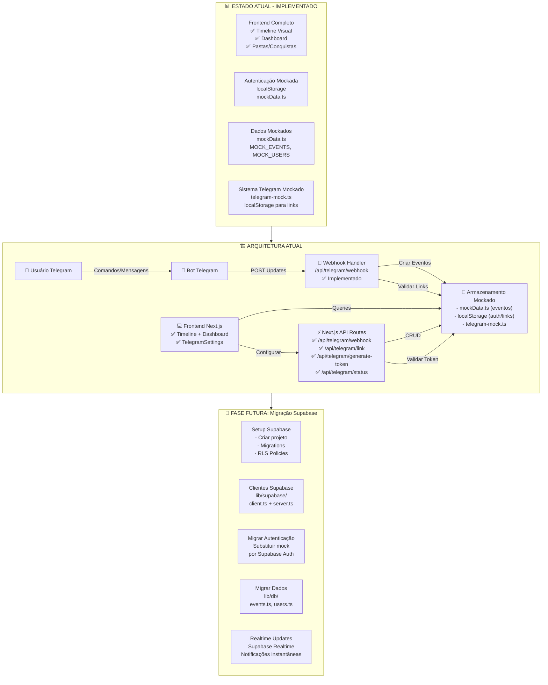
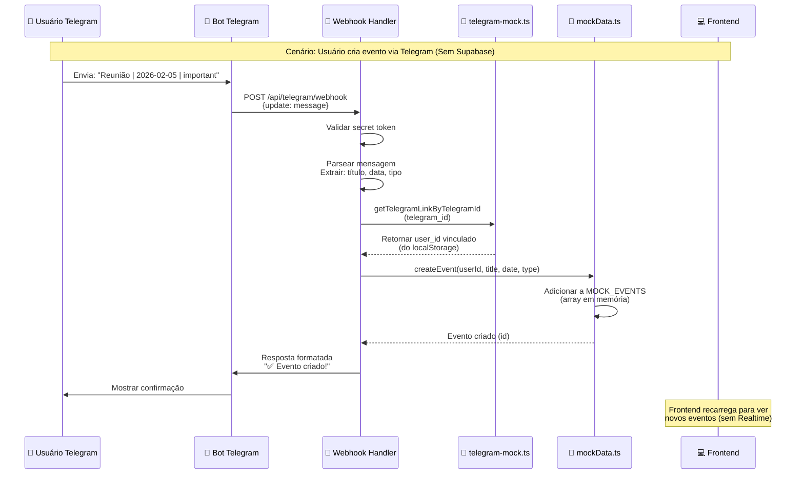
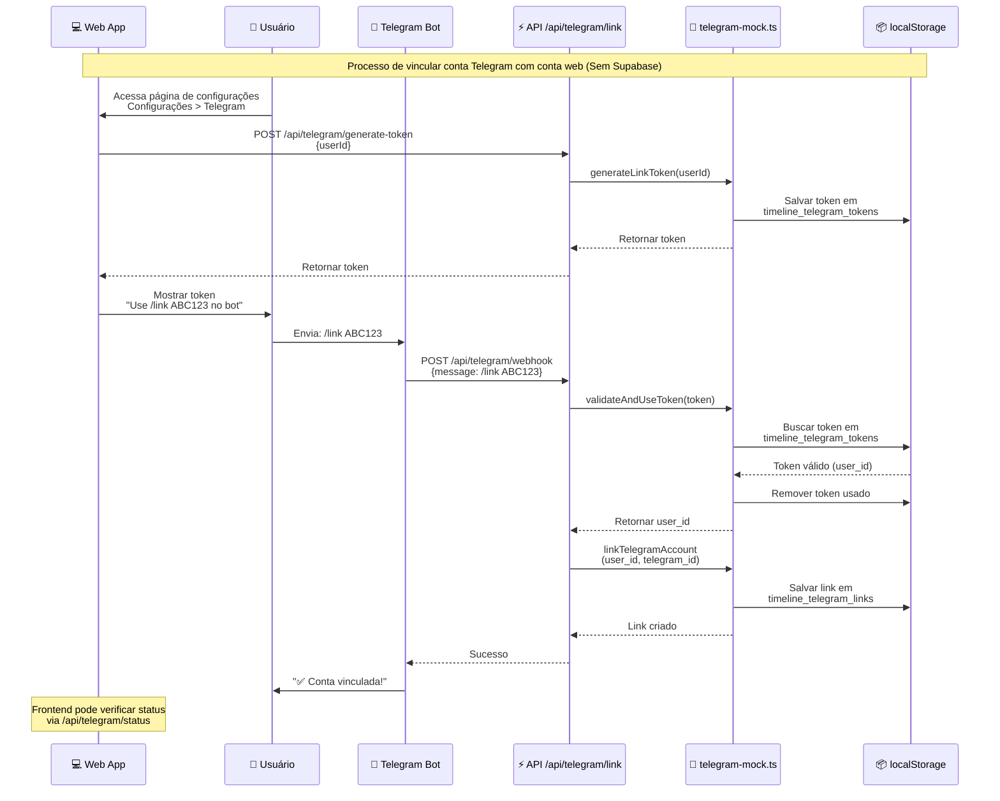
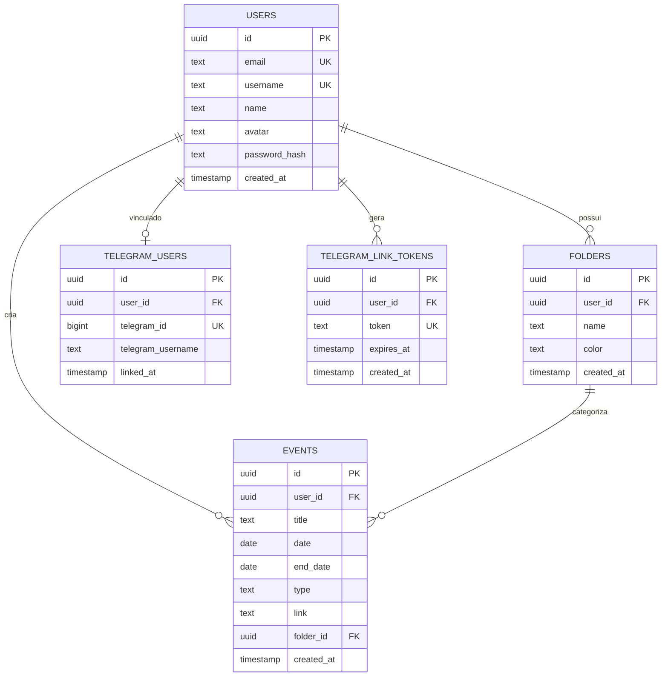
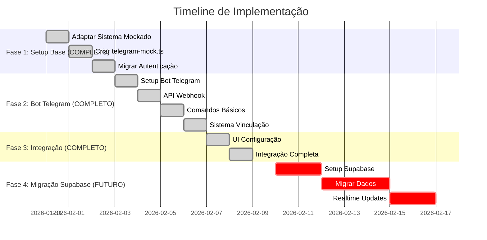
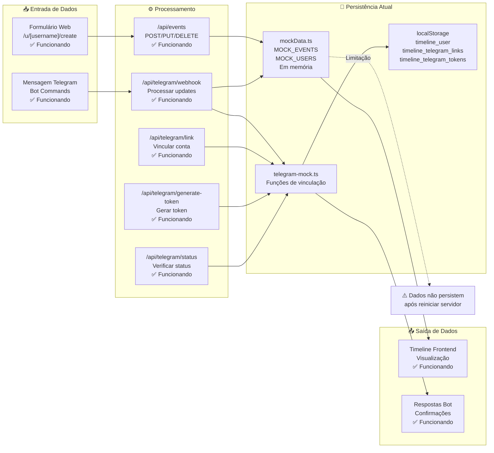
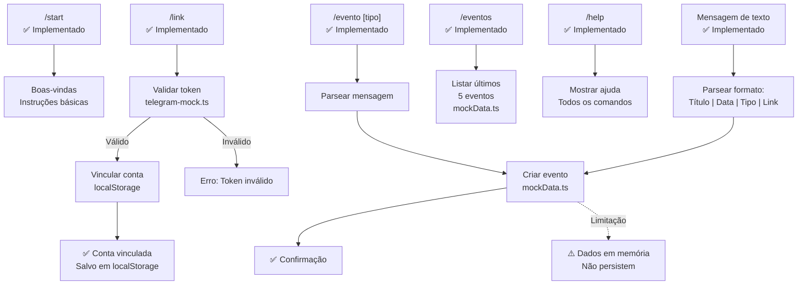

# 🗺️ Roadmap Completo - Timeline Agenda MVP

## Diagrama de Arquitetura e Fluxo do Projeto (Implementação Atual - Sem Supabase)



## Fluxo de Criação de Evento via Telegram (Implementação Atual)



## Fluxo de Vinculação Telegram ↔ Conta Web (Implementação Atual)



## Estrutura de Dados Atual (Mockado)

```mermaid
erDiagram
    MOCK_USERS ||--o{ MOCK_EVENTS : cria
    MOCK_AUTH_USERS ||--o| TELEGRAM_LINKS : vinculado
    MOCK_AUTH_USERS ||--o{ TELEGRAM_TOKENS : gera

    MOCK_USERS {
        string id PK
        string username UK
        string name
        string avatar
    }

    MOCK_AUTH_USERS {
        string id PK
        string email UK
        string username UK
        string name
        string password
        string avatar
    }

    MOCK_EVENTS {
        string id PK
        string user_id FK
        string title
        string date
        string endDate
        string type
        string link
        string folder
    }

    TELEGRAM_LINKS {
        string userId FK
        number telegramId UK
        string telegramUsername
        string linkedAt
        Note: "Salvo em localStorage<br/>timeline_telegram_links"
    }

    TELEGRAM_TOKENS {
        string userId FK
        string token UK
        string expiresAt
        string createdAt
        Note: "Salvo em localStorage<br/>timeline_telegram_tokens"
    }
```

## Estrutura de Banco de Dados (Futuro - Supabase)



## Roadmap de Implementação - Timeline



## Fluxo de Dados Completo (Implementação Atual)



## Comandos do Bot Telegram (Implementação Atual)



## Estrutura de Arquivos do Projeto (Implementação Atual)

```
timeline-agenda/
├── app/
│   ├── api/
│   │   ├── telegram/
│   │   │   ├── webhook/
│   │   │   │   └── route.ts          ✅ IMPLEMENTADO: Webhook handler
│   │   │   ├── link/
│   │   │   │   └── route.ts          ✅ IMPLEMENTADO: Endpoint vinculação
│   │   │   ├── generate-token/
│   │   │   │   └── route.ts          ✅ IMPLEMENTADO: Gerar token
│   │   │   └── status/
│   │   │       └── route.ts          ✅ IMPLEMENTADO: Verificar status
│   │   └── events/
│   │       └── route.ts              ✅ IMPLEMENTADO: API REST eventos
│   ├── auth/
│   │   ├── login/page.tsx            ✅ FUNCIONANDO: Mockado
│   │   └── register/page.tsx         ✅ FUNCIONANDO: Mockado
│   └── u/[username]/
│       ├── page.tsx                  ✅ FUNCIONANDO: Dados mockados
│       └── create/page.tsx           ✅ FUNCIONANDO: Salvar mockData
│
├── components/
│   ├── Dashboard.tsx                 ✅ MODIFICADO: Seção Telegram adicionada
│   ├── EventForm.tsx                 ✅ MODIFICADO: Usa API mockada
│   └── TelegramSettings.tsx           ✅ IMPLEMENTADO: Configuração Telegram
│
├── contexts/
│   └── AuthContext.tsx               ✅ MODIFICADO: localStorage
│
├── lib/
│   ├── telegram-mock.ts              ✅ NOVO: Sistema vinculação Telegram
│   ├── auth.ts                       ✅ MODIFICADO: Sistema mockado
│   └── mockData.ts                   ✅ EM USO: Dados mockados
│
└── supabase/
    └── migrations/                   📋 PRONTO: Migrations SQL (para futuro)
        ├── 001_create_users.sql
        ├── 002_create_events.sql
        ├── 003_create_folders.sql
        ├── 004_create_telegram_users.sql
        └── 005_create_telegram_tokens.sql
```

**Legenda:**
- ✅ = Implementado e funcionando
- 📋 = Criado mas não em uso (para migração futura)

## Variáveis de Ambiente Necessárias (Implementação Atual)

```env
# Telegram (OBRIGATÓRIO)
TELEGRAM_BOT_TOKEN=123456789:ABCdefGHIjklMNOpqrsTUVwxyz
TELEGRAM_WEBHOOK_SECRET=secreto_aleatorio_para_validacao

# App (OPCIONAL - para webhook)
NEXT_PUBLIC_APP_URL=http://localhost:3000

# Supabase (OPCIONAL - para migração futura)
# NEXT_PUBLIC_SUPABASE_URL=https://xxxxx.supabase.co
# NEXT_PUBLIC_SUPABASE_ANON_KEY=eyJhbGciOiJIUzI1NiIsInR5cCI6IkpXVCJ9...
# SUPABASE_SERVICE_ROLE_KEY=eyJhbGciOiJIUzI1NiIsInR5cCI6IkpXVCJ9...
```

## Checklist de Implementação

### ✅ Fase 1: Setup Base (COMPLETO - Sem Supabase)

#### Sistema Mockado
- [x] Adaptar sistema para funcionar sem Supabase
- [x] Criar `lib/telegram-mock.ts` com funções de vinculação usando localStorage
- [x] Implementar funções: `getTelegramLinkByTelegramId`, `getTelegramLinkByUserId`
- [x] Implementar funções: `linkTelegramAccount`, `unlinkTelegramAccount`
- [x] Implementar funções: `generateLinkToken`, `validateAndUseToken`
- [x] Implementar função: `cleanupExpiredTokens`

#### Autenticação
- [x] Migrar `lib/auth.ts` para usar sistema mockado (mockLogin, mockRegister)
- [x] Atualizar `contexts/AuthContext.tsx` para usar localStorage
- [x] Remover dependências do Supabase Auth
- [x] Manter compatibilidade com interface AuthUser

#### Dados Mockados
- [x] Manter `lib/mockData.ts` funcionando
- [x] Usar MOCK_EVENTS para armazenar eventos
- [x] Usar MOCK_AUTH_USERS para autenticação
- [x] Usar MOCK_USERS para perfis públicos

### ✅ Fase 2: Bot Telegram (COMPLETO)

#### Setup Bot
- [x] Criar bot via @BotFather
- [x] Obter BOT_TOKEN
- [x] Configurar webhook (dev: ngrok, prod: Vercel)
- [x] Instalar dependência `grammy`

#### API Webhook
- [x] Criar `app/api/telegram/webhook/route.ts`
- [x] Implementar validação de secret token (`validateWebhook`)
- [x] Implementar parser de mensagens de texto (`parseEventMessage`)
- [x] Integrar com `telegram-mock.ts` para buscar links
- [x] Integrar com `mockData.ts` para criar eventos

#### Comandos do Bot
- [x] Implementar comando `/start` - Boas-vindas e instruções
- [x] Implementar comando `/help` - Lista de comandos disponíveis
- [x] Implementar comando `/link <token>` - Vincular conta Telegram
- [x] Implementar comando `/evento <título> <data> [tipo]` - Criar evento rápido
- [x] Implementar comando `/eventos` - Listar últimos 5 eventos
- [x] Implementar parser de mensagens de texto para criar eventos automaticamente

#### API Routes de Vinculação
- [x] Criar `app/api/telegram/link/route.ts` - Endpoint de vinculação
- [x] Criar `app/api/telegram/generate-token/route.ts` - Gerar token de vinculação
- [x] Criar `app/api/telegram/status/route.ts` - Verificar status de vinculação
- [x] Integrar todas as rotas com `telegram-mock.ts`

### ✅ Fase 3: Integração Frontend (COMPLETO)

#### Componente TelegramSettings
- [x] Criar `components/TelegramSettings.tsx`
- [x] Implementar verificação de status de vinculação
- [x] Implementar geração de token de vinculação
- [x] Implementar interface para copiar token
- [x] Mostrar instruções de uso do bot
- [x] Exibir status de vinculação (vinculado/não vinculado)
- [x] Adicionar feedback visual (sucesso/erro)

#### Dashboard
- [x] Adicionar seção "Telegram" no `components/Dashboard.tsx`
- [x] Criar botão de navegação para seção Telegram
- [x] Integrar `TelegramSettings` no Dashboard
- [x] Mostrar apenas para usuário autenticado (próprio perfil)

#### Formulários e Páginas
- [x] Atualizar `app/u/[username]/create/page.tsx` para usar API mockada
- [x] Atualizar `components/EventForm.tsx` para buscar pastas via API
- [x] Criar `app/api/events/route.ts` para CRUD de eventos
- [x] Criar `app/api/folders/route.ts` para CRUD de pastas

### 🔮 Fase 4: Migração Futura para Supabase (PENDENTE - Opcional)

#### Setup Supabase
- [ ] Criar projeto no Supabase
- [ ] Configurar variáveis de ambiente (NEXT_PUBLIC_SUPABASE_URL, etc.)
- [ ] Executar migrations SQL (já criadas em `supabase/migrations/`):
  - [ ] `001_create_users.sql`
  - [ ] `002_create_folders.sql`
  - [ ] `003_create_events.sql`
  - [ ] `004_create_telegram_users.sql`
  - [ ] `005_create_telegram_link_tokens.sql`
- [ ] Configurar RLS policies (já incluídas nas migrations)

#### Dependências e Clientes
- [ ] Instalar dependências (@supabase/supabase-js, @supabase/ssr)
- [ ] Criar `lib/supabase/client.ts` (já criado, precisa configurar)
- [ ] Criar `lib/supabase/server.ts` (já criado, precisa configurar)
- [ ] Criar `lib/supabase/admin.ts` (já criado, precisa configurar)

#### Migração de Dados
- [ ] Migrar `lib/auth.ts` para usar Supabase Auth
- [ ] Migrar `contexts/AuthContext.tsx` para Supabase Auth
- [ ] Criar `lib/db/events.ts` (já criado, precisa integrar)
- [ ] Criar `lib/db/users.ts` (já criado, precisa integrar)
- [ ] Criar `lib/db/folders.ts` (já criado, precisa integrar)
- [ ] Criar `lib/db/telegram.ts` (já criado, precisa integrar)
- [ ] Atualizar componentes para usar dados reais do Supabase

#### Realtime e Notificações
- [ ] Configurar Supabase Realtime para tabela `events`
- [ ] Implementar subscriptions no frontend
- [ ] Adicionar notificações quando evento é criado via Telegram
- [ ] Atualizar timeline automaticamente com Realtime

#### Limpeza
- [ ] Marcar `lib/mockData.ts` como deprecated
- [ ] Marcar `lib/telegram-mock.ts` como deprecated
- [ ] Remover código mockado após migração completa
- [ ] Atualizar documentação

### 📊 Resumo do Status

**✅ Implementado e Funcionando:**
- Sistema completo de autenticação mockado
- Bot Telegram totalmente funcional
- Sistema de vinculação Telegram ↔ Conta Web
- Interface de configuração Telegram
- Todos os comandos do bot implementados
- API routes todas funcionando

**⚠️ Limitações Atuais:**
- Dados não persistem após reiniciar servidor (apenas em memória)
- Sem sincronização entre dispositivos
- Sem Realtime updates
- Apenas para desenvolvimento/testes

**🔮 Próximos Passos (Opcional):**
- Migração para Supabase quando necessário
- Implementação de Realtime updates
- Persistência de dados permanente

## Status Atual da Implementação

### ✅ COMPLETO (Sem Supabase)
- Sistema de autenticação mockado funcionando
- Bot Telegram completamente funcional
- Sistema de vinculação Telegram implementado
- Todos os comandos do bot funcionando
- Interface de configuração Telegram pronta
- API routes todas funcionando

### 🔮 PRÓXIMOS PASSOS (Migração Supabase - Opcional)
1. **Criar projeto Supabase** e obter credenciais
2. **Configurar variáveis de ambiente** (.env.local)
3. **Executar migrations SQL** (já criadas em supabase/migrations/)
4. **Instalar dependências** Supabase
5. **Migrar funções** de mockData para Supabase
6. **Configurar Realtime** para atualizações instantâneas

---

**Status Atual**: ✅ **IMPLEMENTAÇÃO COMPLETA (Sem Supabase)**  
**Sistema Funcionando**: 🤖 Bot Telegram + Frontend integrado  
**Próxima Fase (Opcional)**: 🔮 Migração para Supabase quando necessário
