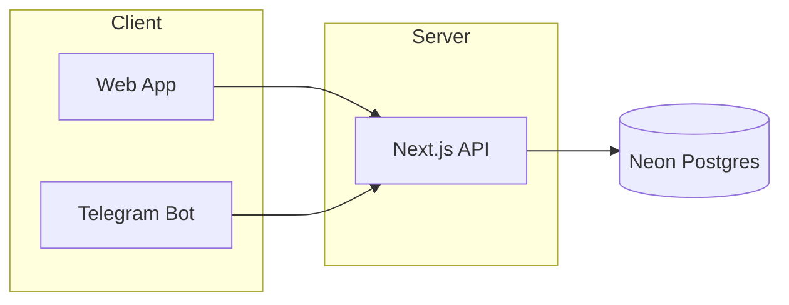
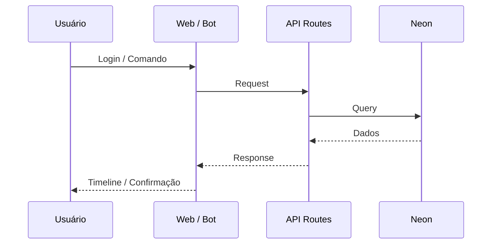

# Timeline Diary

Timeline visual de eventos: web + bot Telegram. Next.js, Neon (PostgreSQL), autenticação por sessão.

---

## TL;DR

```bash
npm install
cp .env.local.example .env.local   # preencher variáveis (nunca commitar .env.local)
npm run db:migrate                 # opcional se já rodou no Neon SQL Editor
npm run dev
```

Deploy: conectar repo na Vercel, configurar env vars, deploy. Webhook Telegram após ter a URL. Ver `docs/FALTA_PARA_PRODUCAO.md`.

---

## Arquitetura (resumo)



---

## Fluxo principal



---

## Variáveis de ambiente

Copiar `.env.local.example` para `.env.local` e preencher. **Nunca commitar `.env.local` nem connection strings/tokens.**

| Variável | Uso |
|----------|-----|
| `DATABASE_URL` | Neon PostgreSQL (connection string) |
| `AUTH_SECRET` | Cookie de sessão (min 16 chars) |
| `TELEGRAM_BOT_TOKEN` | Bot do Telegram |
| `TELEGRAM_WEBHOOK_SECRET` | Validação do webhook |
| `NEXT_PUBLIC_APP_URL` | URL pública do app (produção) |

---

## Scripts

| Comando | Descrição |
|---------|-----------|
| `npm run dev` | Desenvolvimento |
| `npm run build` | Build produção |
| `npm start` | Rodar produção |
| `npm run db:migrate` | Rodar migration Neon (usa `DATABASE_URL` do `.env.local`) |

---

## Deploy

1. Código no GitHub (sem `.env` nem dados sensíveis).
2. Vercel → importar repositório → configurar as variáveis acima.
3. Após o deploy: definir `NEXT_PUBLIC_APP_URL` e configurar webhook do Telegram.

Detalhes: **`docs/FALTA_PARA_PRODUCAO.md`**.

---

## Stack

Next.js 16 · TypeScript · Tailwind CSS · Neon (PostgreSQL) · Grammy (Telegram)
