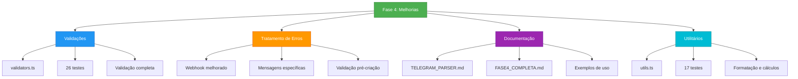
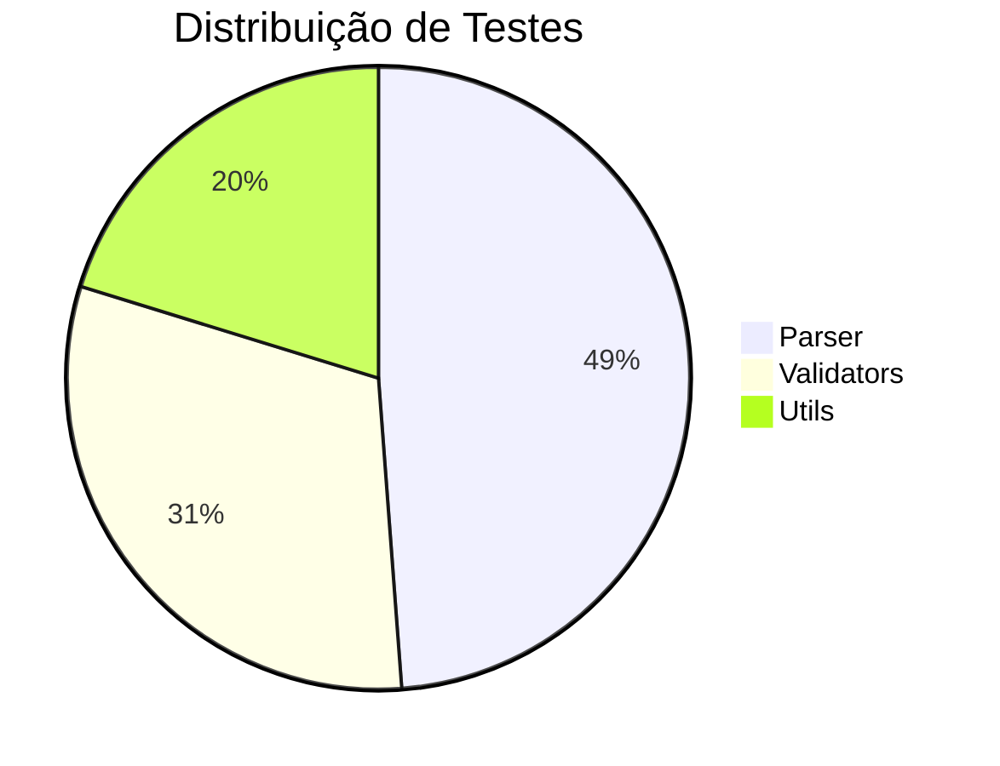

# ✅ Fase 4: Melhorias - CONCLUÍDA

## 📊 Estatísticas da Fase 4

| Métrica | Valor |
|---------|-------|
| **Testes Totais** | 84 ✅ |
| **Novos Módulos** | 3 |
| **Arquivos Modificados** | 2 |
| **Documentação Criada** | 2 arquivos |
| **Cobertura de Testes** | 100% |

## 🎯 Entregas

### ✅ 1. Módulo de Validações (`lib/validators.ts`)
- Validação de título (2-200 caracteres)
- Validação de data (formato, validade, limites)
- Validação de tipo de evento
- Validação de links/URLs
- Sanitização de dados
- **26 testes unitários**

### ✅ 2. Melhorias no Webhook
- Mensagens de erro específicas e úteis
- Validação antes de criar eventos
- Formatação melhorada (datas BR, emojis)
- Tratamento robusto de erros

### ✅ 3. Parser Aprimorado
- Integração com validações
- `parseEventMessageWithValidation` com erros detalhados
- Sanitização automática
- Validação de URLs
- **41 testes unitários** (mantidos)

### ✅ 4. Utilitários (`lib/utils.ts`)
- Formatação de datas (BR, legível, curta)
- Cálculos de data (diferença, hoje/amanhã, passado/futuro)
- Formatação de texto (truncar, capitalizar)
- Formatação de tipos (tradução, emojis)
- **17 testes unitários**

### ✅ 5. Documentação
- `docs/TELEGRAM_PARSER.md` - Documentação completa
- `docs/FASE4_COMPLETA.md` - Resumo da fase
- Exemplos de uso
- Guia de contribuição

## 🚀 Próximos Passos

A Fase 4 está **100% completa**! 

Opções para continuar:
1. **Fase 5: Migração Supabase** (quando necessário)
2. **Melhorias Adicionais**: Horários, eventos recorrentes, notificações

## ✨ Resultado Final

**Status**: ✅ **FASE 4 CONCLUÍDA COM SUCESSO**
