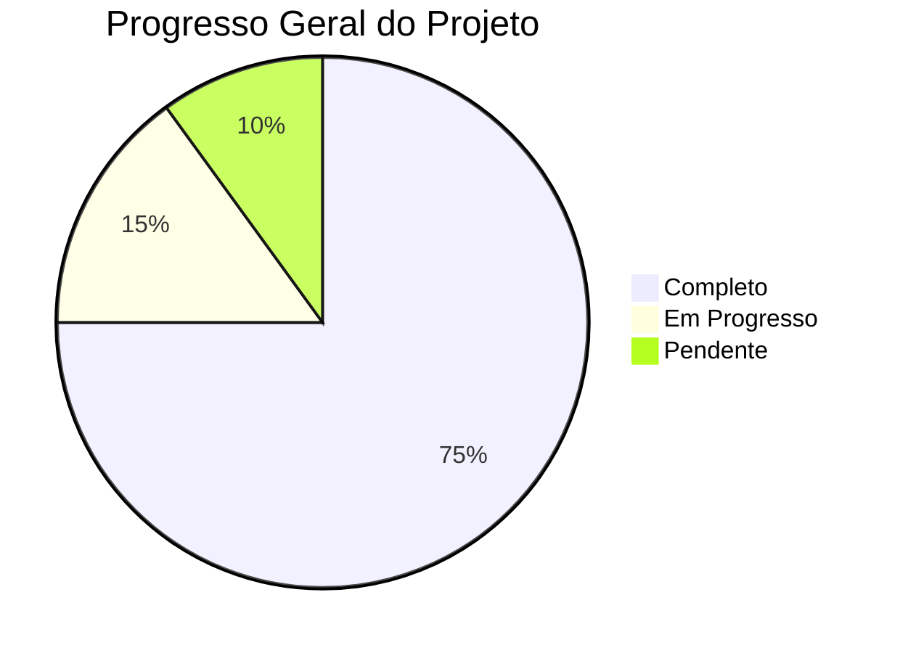
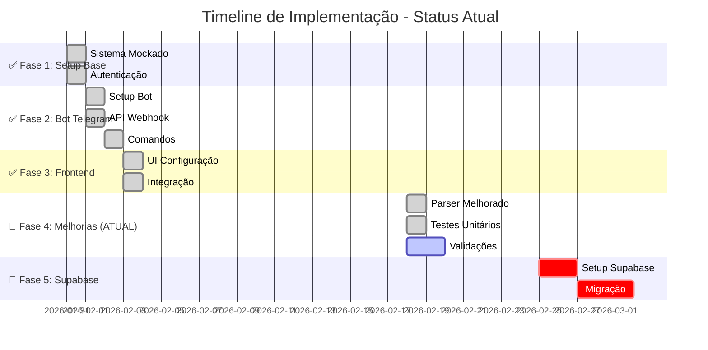

# 📊 Status Atual do Projeto - Timeline Agenda

## Diagrama de Progresso Simplificado

```mermaid
graph LR
    subgraph Fase1["✅ FASE 1: Setup Base<br/>100% COMPLETO"]
        A1[Autenticação Mockada]
        A2[Dados Mockados]
        A3[telegram-mock.ts]
    end
    
    subgraph Fase2["✅ FASE 2: Bot Telegram<br/>100% COMPLETO"]
        B1[Webhook Handler]
        B2[Comandos do Bot]
        B3[Sistema Vinculação]
        B4[API Routes]
    end
    
    subgraph Fase3["✅ FASE 3: Frontend<br/>100% COMPLETO"]
        C1[TelegramSettings]
        C2[Dashboard]
        C3[Formulários]
    end
    
    subgraph Fase4["🔄 FASE 4: Melhorias<br/>EM PROGRESSO"]
        D1[Parser Melhorado ✅]
        D2[Testes Unitários ✅]
        D3[Validações]
        D4[Documentação]
    end
    
    subgraph Fase5["🔮 FASE 5: Supabase<br/>PENDENTE"]
        E1[Setup Supabase]
        E2[Migração Dados]
        E3[Realtime]
    end
    
    Fase1 --> Fase2
    Fase2 --> Fase3
    Fase3 --> Fase4
    Fase4 --> Fase5
    
    style Fase1 fill:#10b981,stroke:#059669,color:#fff
    style Fase2 fill:#10b981,stroke:#059669,color:#fff
    style Fase3 fill:#10b981,stroke:#059669,color:#fff
    style Fase4 fill:#f59e0b,stroke:#d97706,color:#fff
    style Fase5 fill:#6b7280,stroke:#4b5563,color:#fff
```

## Progresso por Fase

## Timeline de Implementação

## Status Detalhado

### ✅ Fase 1: Setup Base (100% Completo)
- ✅ Sistema de autenticação mockado
- ✅ Dados mockados funcionando
- ✅ Sistema de vinculação Telegram

### ✅ Fase 2: Bot Telegram (100% Completo)
- ✅ Webhook handler implementado
- ✅ Todos os comandos funcionando
- ✅ Parser de mensagens básico
- ✅ Sistema de vinculação completo

### ✅ Fase 3: Frontend (100% Completo)
- ✅ Componente TelegramSettings
- ✅ Dashboard integrado
- ✅ Formulários funcionando
- ✅ API routes todas implementadas

### 🔄 Fase 4: Melhorias (Em Progresso - 50%)
- ✅ Parser melhorado criado (suporta múltiplos formatos)
- ✅ Testes unitários criados (41 testes passando)
- ⏳ Validações adicionais
- ⏳ Documentação de uso

### 🔮 Fase 5: Supabase (Pendente - 0%)
- ⏳ Setup do projeto Supabase
- ⏳ Migração de dados
- ⏳ Realtime updates

## Próximos Passos Imediatos

1. **Finalizar Fase 4:**
   - Adicionar mais validações ao parser
   - Melhorar tratamento de erros
   - Documentar uso do parser

2. **Preparar Fase 5:**
   - Avaliar necessidade de Supabase
   - Planejar migração de dados
   - Configurar ambiente de produção

## Métricas Atuais

- **Código Funcional**: ✅ 100%
- **Testes**: ✅ 41 testes passando
- **Cobertura**: 📊 Em progresso
- **Documentação**: 📝 Parcial
- **Deploy**: ⏳ Pendente

---

**Status Atual**: 🔄 **FASE 4 - Melhorias em Progresso**  
**Progresso Geral**: **75% Completo**  
**Próxima Meta**: Finalizar melhorias e preparar para produção
