# 📊 Timeline Diary - Apresentação Visual para Não-Técnicos

## 1. O que é o Timeline Diary?

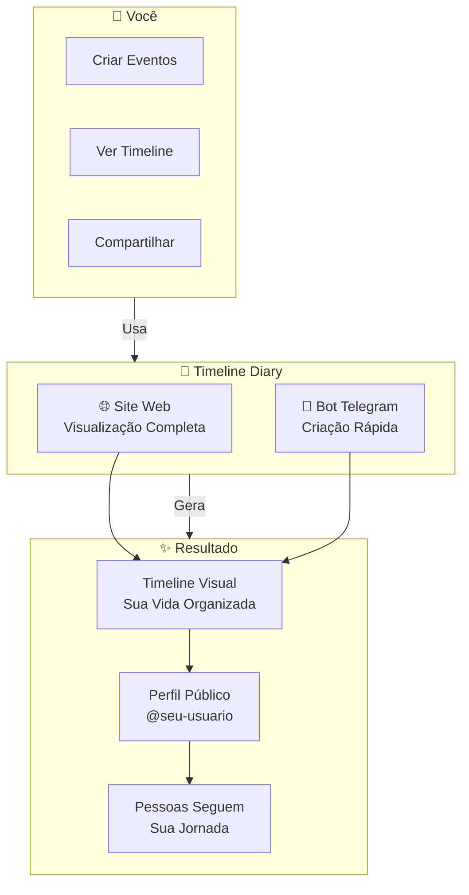

---

## 2. Como Funciona - Fluxo Principal

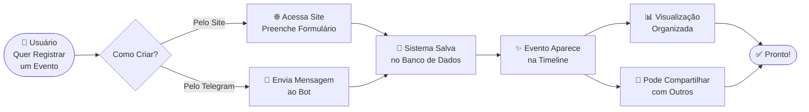

---

## 3. Funcionalidades Principais

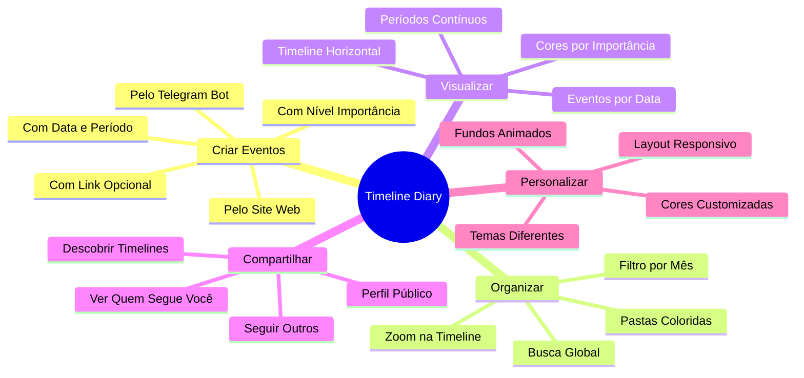

---

## 4. Arquitetura Simplificada - Como os Dados Fluem

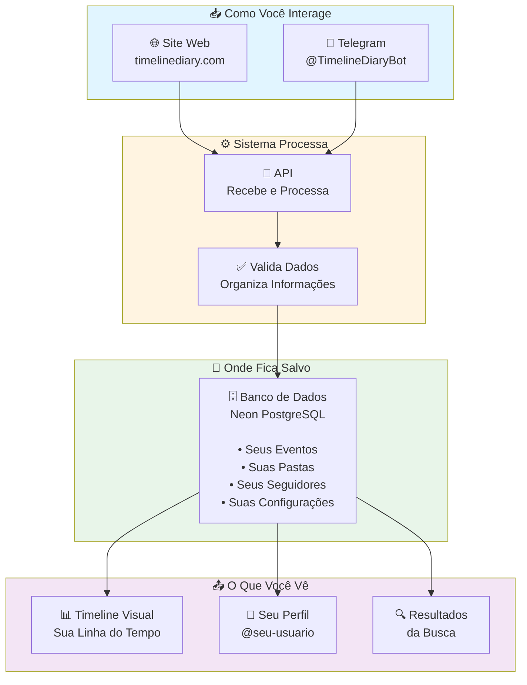

---

## 5. Casos de Uso - Quem Usa e Como

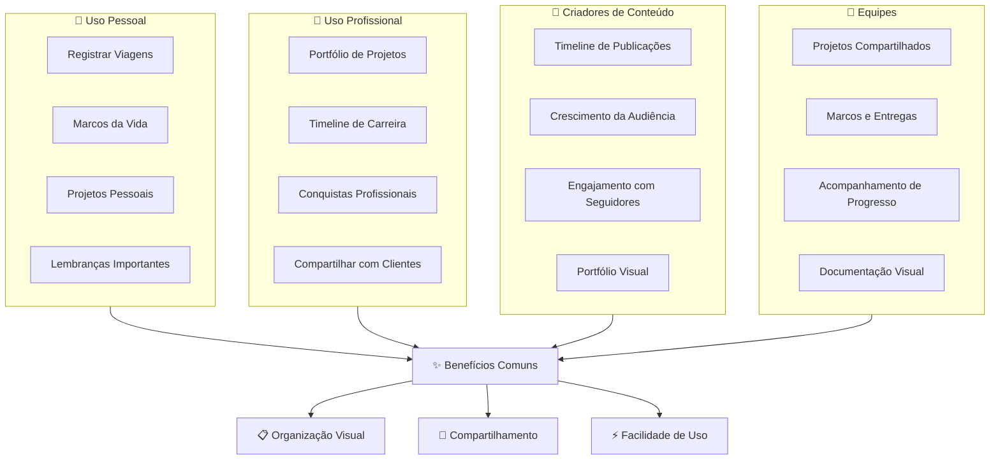

---

## 6. Fluxo de Criação de Evento - Passo a Passo

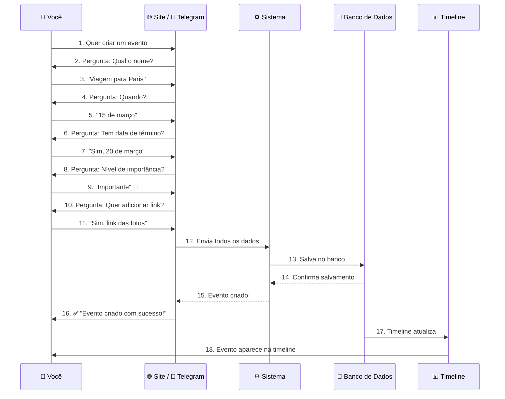

---

## 7. Sistema de Seguir - Como Funciona a Rede Social

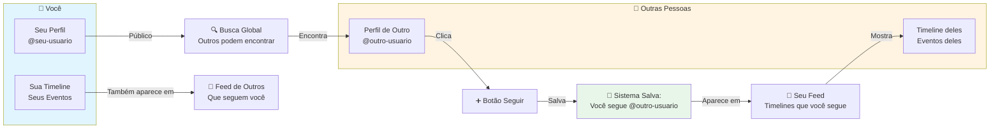

---

## 8. Organização - Pastas e Filtros

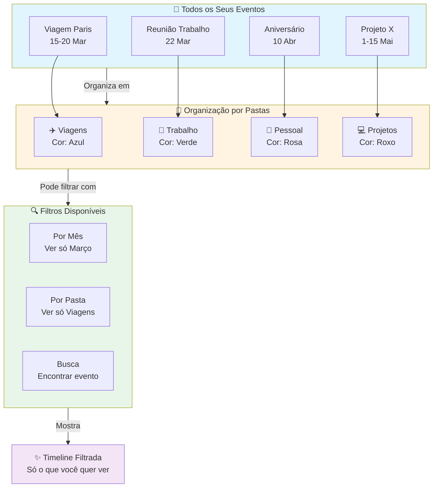

---

## 9. Integração Web + Telegram - Duas Formas de Usar

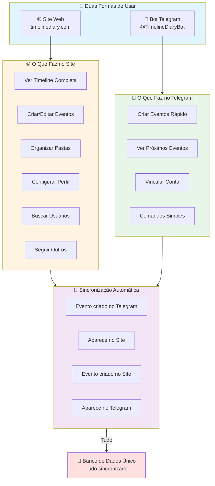

---

## 10. Jornada do Usuário - Do Primeiro Acesso ao Uso Contínuo

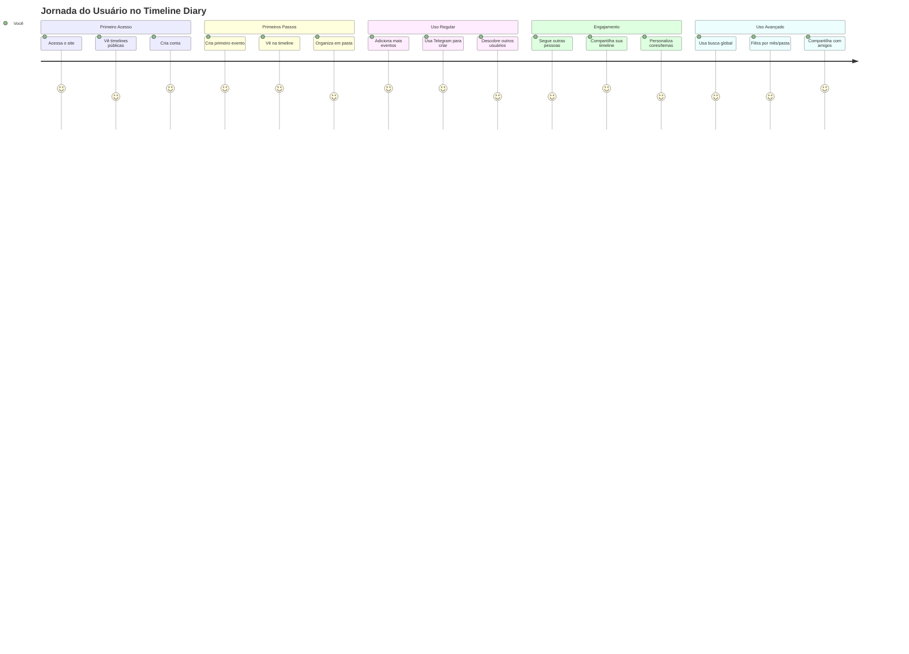

---

## 11. Segurança e Privacidade - Como Seus Dados São Protegidos

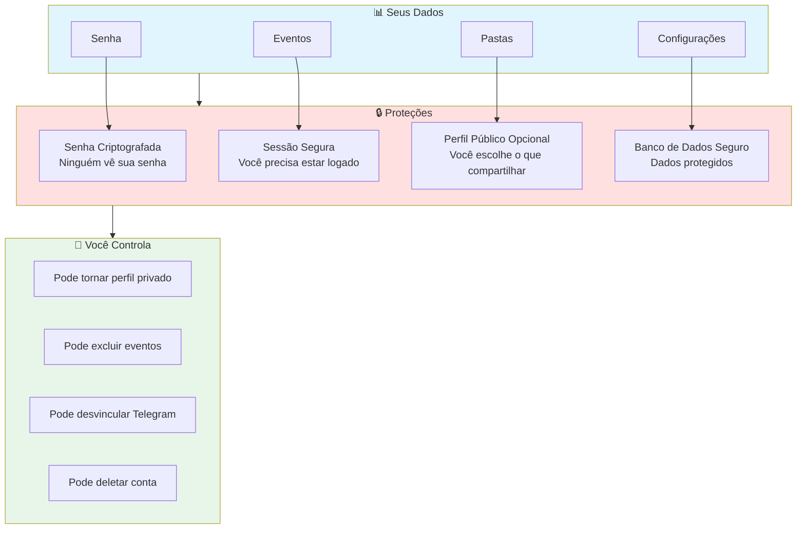

---

## 12. Comparação - Timeline Diary vs Outras Soluções

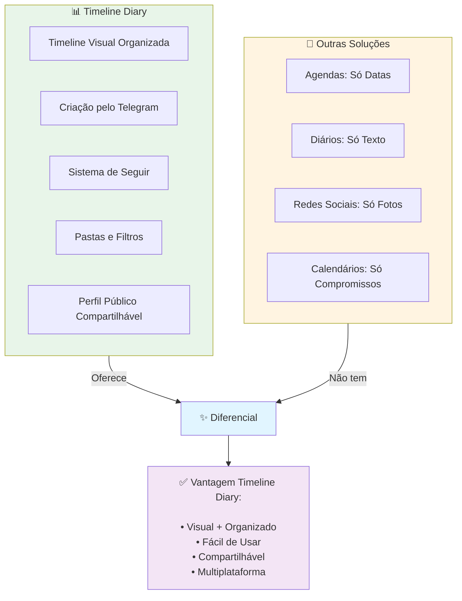

---

## 13. Visão Geral do Sistema - Arquitetura de Alto Nível

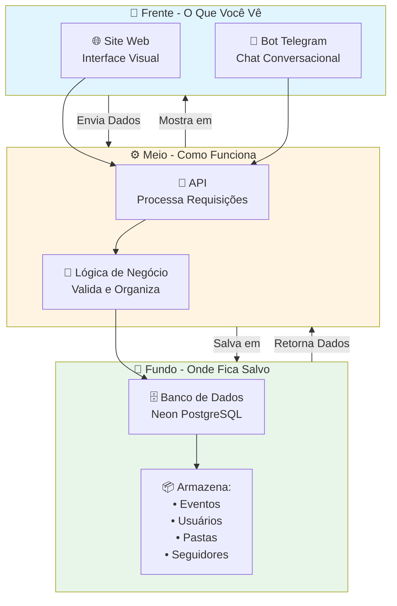

---

## 14. Fluxo de Dados - Como uma Informação Viaja pelo Sistema

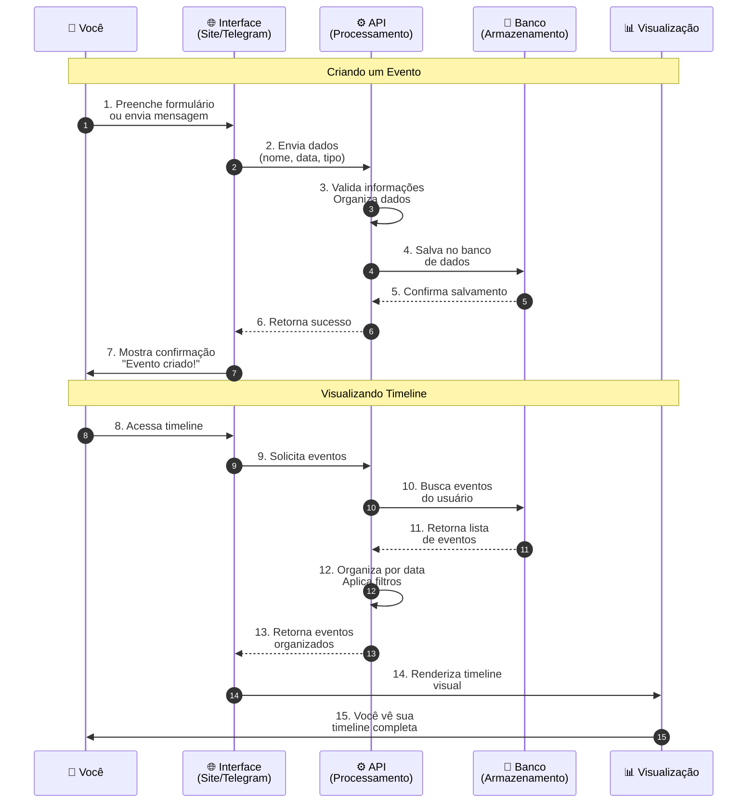

---

## 15. Recursos e Funcionalidades - Mapa Completo

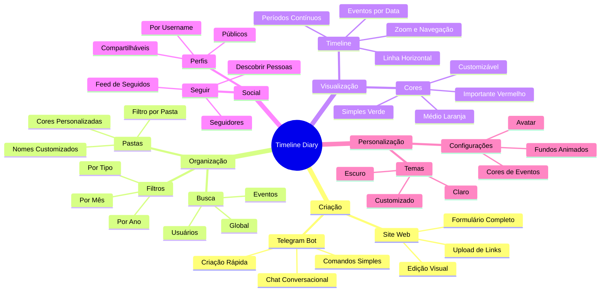

---

## 📝 Notas para Apresentação

### Como Usar Estes Diagramas:

1. **Para Investidores**: Foque nos diagramas 1, 2, 3, 12 e 15 (visão geral, funcionalidades, diferenciais)

2. **Para Usuários Finais**: Use os diagramas 5, 6, 7, 8 e 10 (casos de uso, fluxos, jornada)

3. **Para Parceiros**: Destaque os diagramas 4, 9, 11 e 13 (arquitetura, integração, segurança)

4. **Para Equipe**: Todos os diagramas são úteis para alinhamento

### Dicas de Apresentação:

- Comece sempre pelo diagrama 1 (O que é)
- Use o diagrama 2 (Como funciona) para explicar o fluxo principal
- O diagrama 6 (Fluxo de criação) é ótimo para demos ao vivo
- O diagrama 10 (Jornada) ajuda a mostrar o valor ao longo do tempo
- O diagrama 12 (Comparação) é poderoso para destacar diferenciais

### Personalização:

- Adapte os exemplos (viagens, projetos) para seu público-alvo
- Adicione números reais quando tiver métricas
- Destaque funcionalidades específicas que seu público mais valoriza
