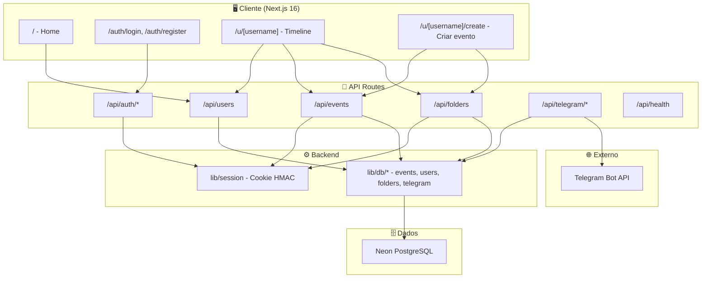
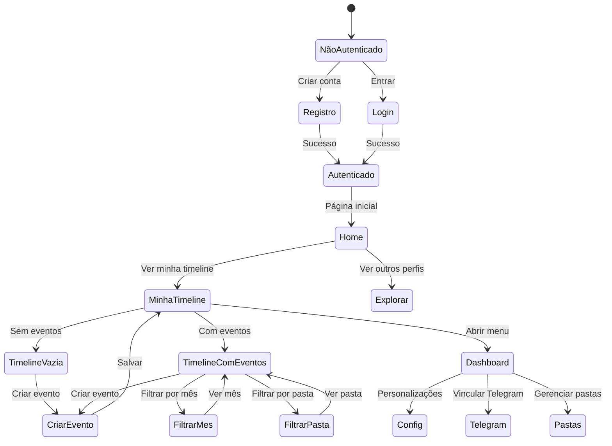
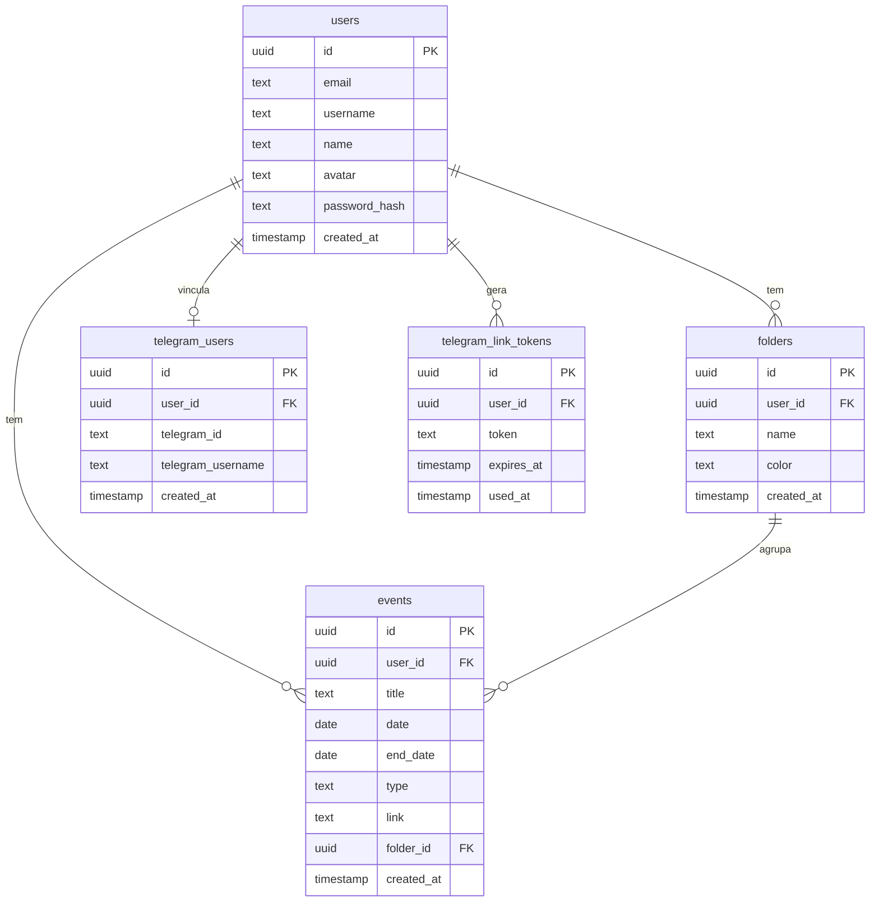
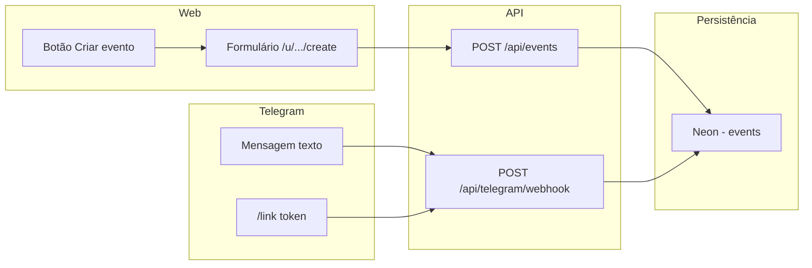
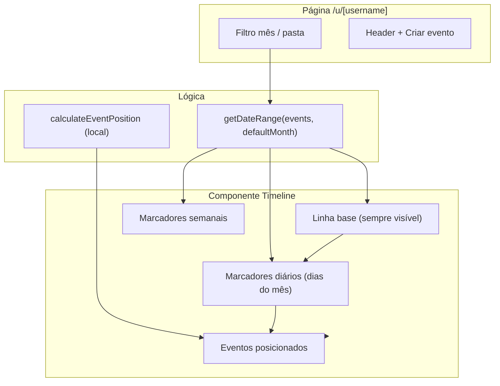
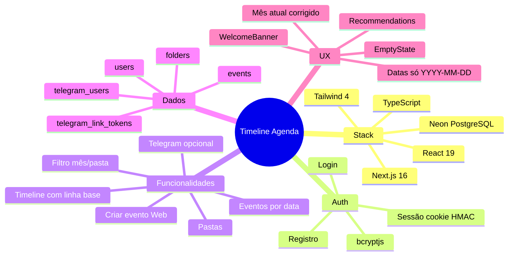
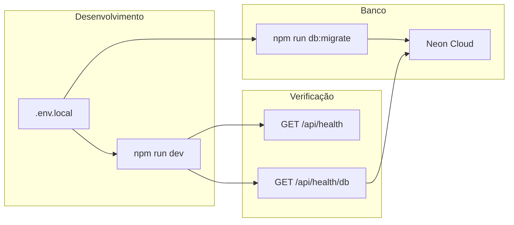

# Estado atual do projeto – Timeline Agenda

Diagramas Mermaid do estado do sistema em **fevereiro de 2026**.

---

## Resumo único: onde estamos e o que falta

```mermaid
flowchart LR
    subgraph FEITO["✅ Onde estamos"]
        A1[Next.js 16 + React 19]
        A2[Auth: registro, login, sessão HMAC]
        A3[Neon PostgreSQL]
        A4[CRUD eventos + pastas]
        A5[Timeline com linha base + dias do mês]
        A6[Criar evento na Web e Telegram]
        A7[Filtro mês/pasta, datas só YYYY-MM-DD]
        A8[WelcomeBanner, Recommendations, EmptyState]
        A9[Editar evento: página + PATCH API]
        A10[Excluir evento: botão + confirmação + DELETE API]
        A11[Busca global: eventos + usuários]
    end

    subgraph FALTA["⏳ O que falta"]
        B1[Onboarding/tour guiado]
        B2[Notificações de eventos próximos]
        B3[Exportar timeline PDF/JSON]
        B4[Compartilhamento social]
        B5[Testes E2E e mais usuários reais]
    end

    FEITO --> FALTA
```

---

## 1. Visão geral da arquitetura

---

## 2. Fluxo do usuário

---

## 3. Modelo de dados (Neon)

---

## 4. Criação de eventos

---

## 5. Timeline (linha base + eventos)

---

## 6. Estado atual – resumo

---

## 7. Deploy e ambiente

---

*Documento gerado a partir do estado do repositório em fevereiro/2026.*
